OpenRefine Kogebog
================
Det Kgl. Bibliotek
28. juni 2022

Dette er en kort introduktion til programmet OpenRefine. Foruden en
beskrivelse af programmet, og hvordan det installeres, gennemgås nogle
af de mest basale funktioner samt nogle eksempler på mere avanceret
brug.

OpenRefine har mange funktioner og kan bruges til mange ting, og denne
vejledning er på ingen måde udtømmende. I stedet er den ment som et
hurtigt overblik med små “opskrifter” til at bruge udvalgte funktioner
og komme i gang med programmet. For en mere grundig gennemgang henvises
til den [officielle dokumentation](https://docs.openrefine.org/).

## Indhold

-   [Hvad er OpenRefine?](#refine)
-   [Installation](#install)
-   [Basale funktioner](#basics)
    -   [Indlæs data](#load)
    -   [Split-funktionen](#split)
    -   [Join-funktionen](#join)
    -   [Transform](#transform)
    -   [Facets](#facets)
    -   [Undo/Redo](#undo)
-   [Avancerede funktioner](#advanced)
    -   [Genbrug historik](#history)
    -   [Allokér ekstra hukommelse](#ram)

## Hvad er OpenRefine? 

OpenRefine er et program, der kan rense, strukturere og berige dine data
på en overskuelig måde. Programmet har mange smarte funktioner, der kan
identificere og udbedre fejl og støj i et datasæt, samt gøre det mere
velstruktureret inden videre behandling.

Programmet vises i en web-browser, men kræver som udgangspunkt ingen
internetforbindelse. Alle data behandles lokalt på computeren.

## Installation 

OpenRefine kan frit downloades fra
<https://openrefine.org/download.html>.

Alt efter hvilket styresystem man bruger findes der forskellige
versioner. Programmet er afhængigt af Java, og vælger man Mac-versionen
vil Java medfølge. Til Windows kan man vælge at hente programmet med
eller uden Java. Er man i tvivl, om Java er installeret på computeren,
anbefales det at hente versionen med Java. Linux-versionen kræver en
separat Java-installation.

**WINDOWS**: Når man har hentet programmet, skal det ikke installeres,
men blot udpakkes. Den udpakkede mappe placeres et sted, hvor man kan
finde frem til den; fx Skrivebord eller Dokument-mappe.

I den udpakkede mappe finder man filen `openrefine.exe`, og når man
dobbeltklikker på ikonet, starter programmet op. Man kan evt. lave en
genvej til `openrefine.exe` et mere tilgængeligt sted; fx på
Skrivebordet.

**MAC**: Når programmet er hentet og åbnet, kan det trækkes til
Applikations-mappen og er nu at finde sammen med de øvrige programmer.

**LINUX**: Efter download og udpakning navigeres til programmappen via
terminalen, og programmet startes med kommandoen `./refine`.

Fælles for alle systemer er, at når OpenRefine startes op, åbner det et
nyt browser-vindue, som fungerer som programmets brugergrænseflade, mens
selve programmet kører i baggrunden. Det anbefales at bruge Firefox
eller Google Chrome sammen med programmet.

For mere information og hjælp til opsætning se
<https://docs.openrefine.org/manual/installing>.

## Basale funktioner 

Nedenfor findes en række af OpenRefines mest almindelige funktioner til
at rense og transformere data.

### Indlæs data 

OpenRefine kan håndtere mange forskellige datatyper og -strukture fra
forskellige kilder. Når man åbner en datafil, bliver man præsenteret for
en forhåndsvisning, der varierer alt efter, hvilken type data man
forsøger at indlæse. Her er det muligt at justere på forskellige
parametre for at sikre, at datafilen bliver indlæst korrekt. Ofte vil
den foreslåede standardkonfiguration være tilstrækkelig.

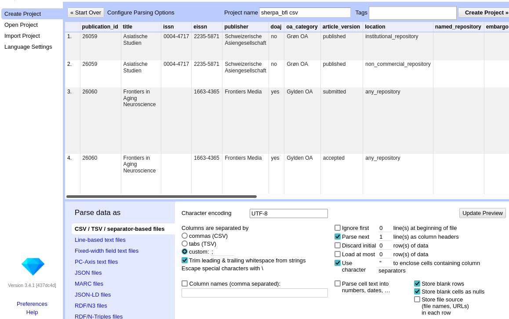

Når datafilen er indlæst, kommer man videre til projektvisningen, hvor
det meste arbejde i programmet vil blive foretaget. Modsat et typisk
regneark i Excel bliver kun en lille del af datasættet vist. Øverst kan
man vælge hvor mange rækker eller *records* visningen skal indeholde.

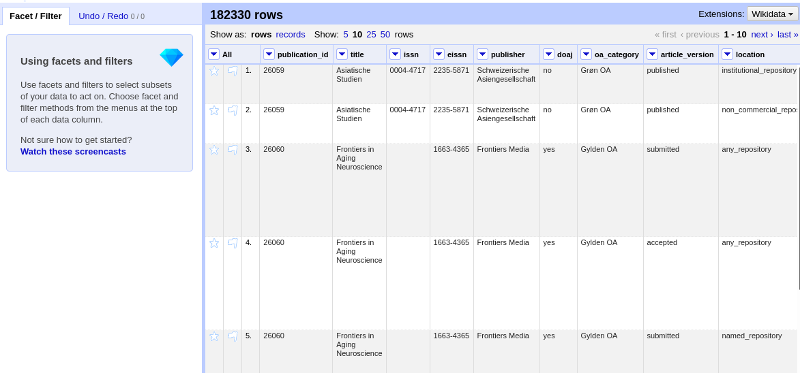

Modsat andre programmer ændrer OpenRefine ikke på de indlæste datafiler.
Alle ændringer, man foretager i programmet, gemmes automatisk i et
projektarkiv, som kan åbnes igen på et senere tidspunkt.

Projektet gemmes også, når man lukker programmet ned. I Windows og Linux
gøres dette ved at vælge det bagvedliggende kommandovindue og trykke
`Ctrl + C`. I MacOS lukkes programmet fra menulinjen som andre
programmer.

Hvis man skal bruge de oprensede data uden for OpenRefine eller på en
anden computer, kan man eksportere dem som et OpenRefine-projekt eller
en række filformater som Excel og CSV.

### Split-funktionen 

Nogle gange kan det være nyttigt at splitte en kolonne op i flere
kolonner. Funktionen findes under *Edit column* for den enkelte kolonne.

For at splitte dataværdierne på en hensigtsmæssig måde, angives en
værdi, som er tilstede i datacellerne, som separator. Afhængigt af
datasættets struktur, kan man også vælge at opdele kolonnen baseret på
antallet af nye kolonner eller en afgrænset længde.

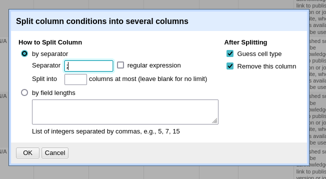

Medmindre vores data er helt ensartet, vil vi formentlig have tomme
celler efter opdelingen, da der vil være forskel på, hvor mange
separatorer, der findes i cellerne.

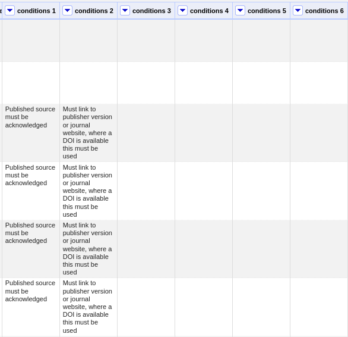

### Join-funktionen 

På samme måde kan man også samle flere kolonner til én kolonne. Denne
funktion findes også under *Edit column*.

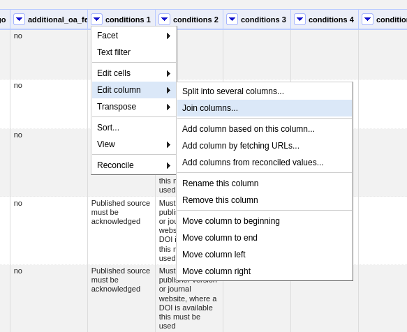

Her angives en separator-værdi, som vil adskille de enkelte dataværdier
i den nye kolonne. Sørg for at vælge en separator, som ikke findes i
dataværdierne, hvis det skal være muligt at adskille dem igen på et
senere tidspunkt; fx `;` eller `|`.

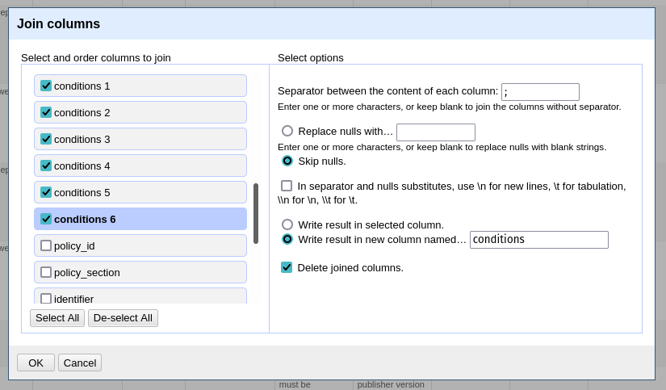

Vi vælger også, om vi vil udelade eventuelle tomme celler eller erstatte
dem med en standardværdi.

Vi har mulighed for at angive et navn for den nye kolonne; alternativt
bruges navnet fra den første af de samlede kolonner.

Endelig har vi mulighed for at beholde eller slette de oprindelige
kolonner.

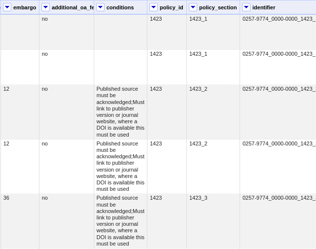

### Transform 

*Transform* dækker over en lang række funktioner, der, som navnet
antyder, kan transformere data.

Disse transformeringer kan udføres med det indbyggede
programmeringssprog GREL (General Refine Expression Language), og der er
stort set ikke grænser for, hvad man kan gøre med sine data. Dog er GREL
uden for rammerne af denne korte introduktion, men har man mod på det,
kan man læse mere om, hvordan man kommer i gang med GREL i
[dokumentationen](https://docs.openrefine.org/manual/grel).

I stedet finder man under *Common transforms* en række af de mest
almindelige transformeringer, som let kan anvendes på datasættet. Man
kan fx fjerne *whitespace* (ekstra mellemrum, der har sneget sig ind i
starten eller slutningen af celler), konvertere alle værdier til store
eller små bogstaver, eller stort begyndelsesbogstav og ændre på
kolonnens datatype.

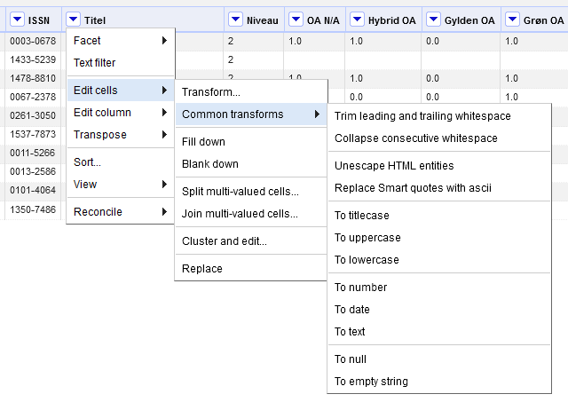

### Facets 

En af de mest nyttige funktioner i OpenRefine er *facets*. Facets gør
det muligt at skabe et hurtigt overblik over et datasæt. De kan bruges
til at finde og udbedre fejl og mangler ved at facettere data ud fra
forskellige parametre.

Den mest almindelige facettering er *Text facet*. Når den bruges på en
kolonne, får man en liste over alle unikke værdier i kolonnen samt hvor
mange gange, de hver især optræder.

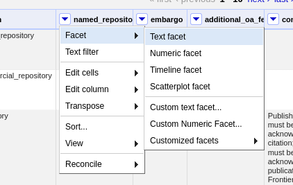

Her kan man filtrere datasættet med *include*, hvis man kun vil arbejde
videre med de rækker, der har en bestemt værdi i den facetterede
kolonne.

Facetteringen giver også mulighed for at få øje på inkonsekvent
navngivning, der gør at celler, der repræsenterer den samme værdi er
spredt over flere kategorier; fx på grund af forskellige brug af store
og små bogstaver.

Her kan man nemt rette et navn med *edit*, så de to værdier
efterfølgende er samlet under ét navn.

Denne operation er nem at anvende så længde, listen med valgmuligheder
er overskuelig. Er listen lang, kan man forsøge at anvende
*Cluster*-funktionen. Her bruger OpenRefine en række
maskinlæringsalgoritmer til at identificere grupper af navne, der ligner
hinanden så meget, at de sandsynligvis repræsenterer den samme værdi.
Efterfølgende kan man nemt vælge, hvilke grupper, der skal forenes, og
hvad den nye gruppe skal hedde.

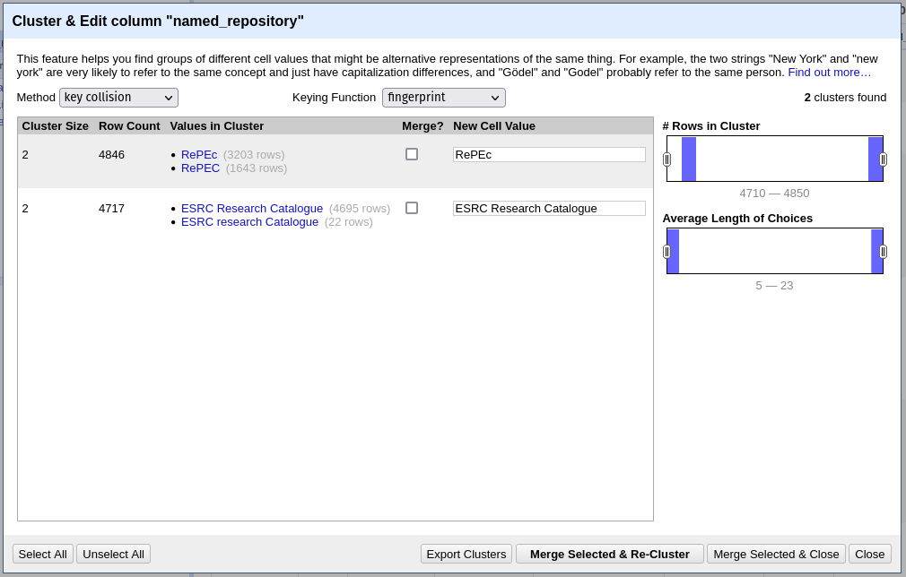

### Undo/Redo 

Til venstre i projektvisningen finder vi fanen *Undo/Redo*. Her har vi
mulighed for at fortryde operationer ved at træde et eller flere trin
tilbage i historikken. Vi kan også træde frem i historikken igen og
genudføre en fortrudt handling.

Denne funktion fungerer også fremragende som dokumentation for, hvordan
man har behandlet sine data. Bemærk at hvis man fortryder en handling og
udfører en ny operation, kan man ikke længere genudføre den fortrudte
handling.

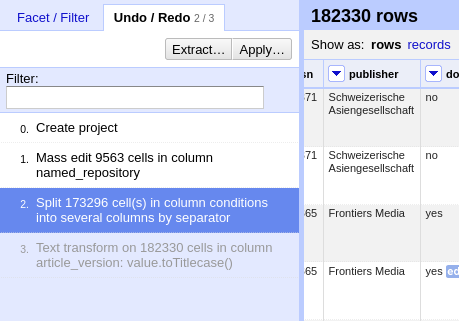

## Avancerede funktioner 

Nedenfor findes nogle af de mere avancerede funktioner i OpenRefine, som
man typisk først vil kaste sig ud i, når man er blevet fortrolig med
programmet og dets grundlæggende funktioner.

### Genbrug historik 

Når man har udført en række operationer med OpenRefine, kan historikken
eksporteres i JSON-format. Det er nyttigt, hvis man gemme vil den som
dokumentation.

Samtidigt kan man også genindlæse historikken på et senere tidspunkt med
et nyt datasæt, som efterfølgende vil blive behandlet efter hvert trin i
historikken på samme måde som det oprindelige datasæt. Det er særligt
nyttigt, hvis man løbende arbejder med lignende datasæt, der kræver den
samme række af operationer. Bemærk, at strukturen på de forskellige
datasæt skal være bygget op på samme måde, da det ellers kan give fejl
eller utilsigtede resultater.

Historikken udtrækkes ved at vælge *Extract…* under *Undo/Redo* fanen.

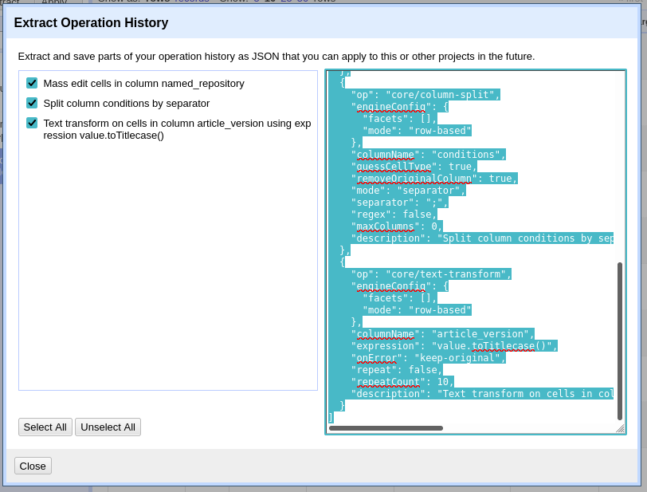

I venstre side af billedet har man nu en oversigt, hvor man kan vælge
eller fravælge operationer fra historikken. Som udgangspunkt er alle
trin medtaget.

I højre side findes historikken i JSON-format. Hele den markerede tekst
kopieres og gemmes efterfølgende i en tekstfil.

For at indlæse historikken på et senere tidspunkt med et tilsvarende
datasæt, vælger man *Apply…* under *Undo/Redo* fanen. Her kopier man sin
JSON-historik ind og trykker *Perform Operations*.

Historikken vil nu trin for trin blive genudført på det nye datasæt.

### Allokér ekstra hukommelse 

Til de fleste formål vil man kunne klare sig med standardopsætningen af
OpenRefine. Arbejder man med særligt store datasæt, kan det dog være
nødvendigt at allokere ekstra hukommelse (RAM) til programmet.

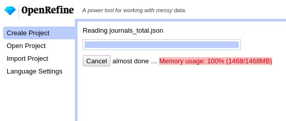

Dette gøres ved at ændre i konfigurationsfilen, der indlæses ved
programmets opstart. Afhængigt af hvilket styresystem, man bruger, er
fremgangsmåden lidt forskellig.

**WINDOWS**

I programmappen findes filen `openrefine.l4j`, der åbnes i et
tekstprogram. Under `# max memory memory heap size` kan man se den
aktuelle maksimale tildeling af hukommelse. Her kan man ændre
hukommelsesbegrænsningen ved at øge tallet i linjen `-Xmx****M`; fx fra
`Xmx1024M` til `Xmx2048M`. Efterfølgende gemmes filen og programmet
startes op som normalt. 

**MAC**

I applikationsmappen højreklikker man på OpenRefine og vælger *Vis
indholdet af pakke*. I mappen *contents* finder man filen `info.plist`,
hvor man kan ændre opstartskonfigurationen for OpenRefine. I et
tekstprogram finder man linjen `<string>Xmx****M</string>` (typisk mod
slutningen af filen). Her kan man ændre hukommelsesbegrænsningen ved at
øge tallet i linjen; fx fra `<string>Xmx1024M</string>` til
`<string>Xmx2048M</string>`. Efterfølgende gemmes filen og programmet
startes op som normalt. 

**LINUX**

I Linux kan man angive, hvor meget hukommelse programmet skal have
adgang til, når det startes op fra kommandolinjen. Dette gøres ved at
tilføje kommandoflaget `-m` efterfulgt af et antal megabyte eller
gigabyte hukommelse. Ønsker man fx at tildele programmet 2 GB RAM kan
man starte det med kommandoen `./refine -m 2048M` eller
`./refine -m 2G`. Alternativt kan det ændres under `REFINE_MEMORY` i
filen `refine.ini` i programmappen.

Som udgangspunkt tildeles programmet 1-2 GB RAM afhængigt af, hvilken
version, der bruges. Læs mere om ændring af opstartskonfigurationen i
[dokumentationen](https://docs.openrefine.org/manual/running#starting-with-modifications).
